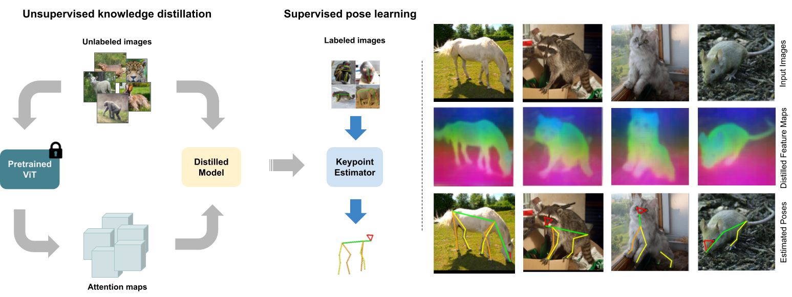

# TARDIS-Pose: Targeted Distillation of Self-Supervised ViT features for Animal Pose Estimation 

 

## Requirements

- Linux (not tested on other platforms)
- Python 3.6 or newer
- PyTorch >= 0.4.0
- CUDA >= 9.0
- cuDNN >= 7.1
- mmcv >= 2.0.1
- mmengine >= 0.8.4

## Getting started

### Install dependencies

```
pip install -r requirements.txt
```

### Prepare datasets

Download AP-10K from:
https://github.com/AlexTheBad/AP-10K

Extract and place data in ./datasets/animal_data/AP-10K

Alternatively, create a symbolic link pointing to your dataset location.


## Training

### Extract ViT features

To extract features using DINOv2-Large for AP-10K training set:

```
python scripts/extract_dino.py
```

Extracted features will be saved to ./data/dino

### Run distillation

Run distillation of HRNet-w32 on AP-10K:

```
python scripts/train.py configs/animal_2d_keypoint/dinopose/ap10k/distill_hrnet_ap10k-256x256.py 
```

Run distillation of ResNet-50 on AP-10K:

```
python scripts/train.py configs/animal_2d_keypoint/dinopose/ap10k/distill_res50_ap10k-256x256.py 
```

Models and logs will be saved to ./work_dirs.


### Train keypoint detection

Update path to distilled model in config file if necessary.

Train fully supervised:

```
python scripts/train.py configs/animal_2d_keypoint/dinopose/ap10k/supervised_distill_hrnet_ap10k-256x256.py 
```

Train few-shot <n_imgs>:
```
python scripts/train.py configs/animal_2d_keypoint/dinopose/ap10k/fewshot<n_imgs>_distill_hrnet_ap10k-256x256.py 
```

For example, to train an HRNet on AP-10K with 5 labeled images per animal:
```
python scripts/train.py configs/animal_2d_keypoint/dinopose/ap10k/fewshot05_distill_hrnet_ap10k-256x256.py 
```


